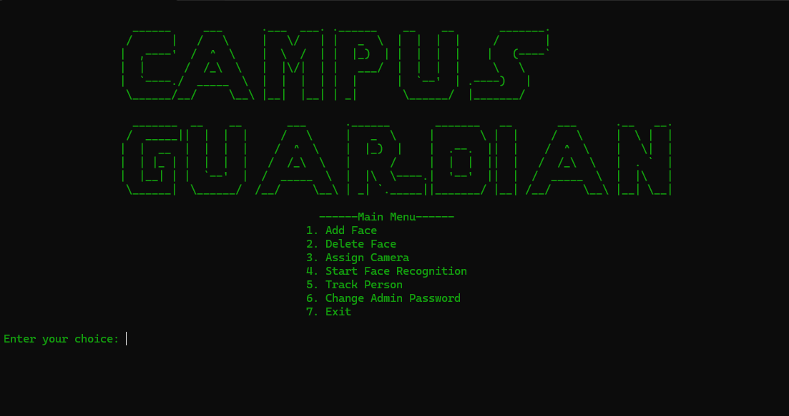
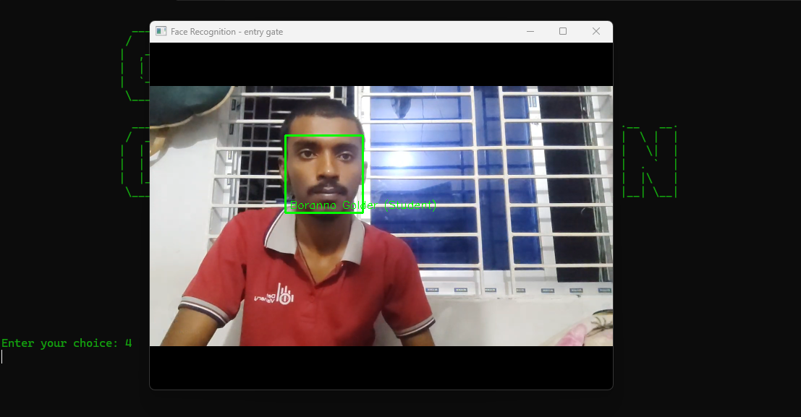
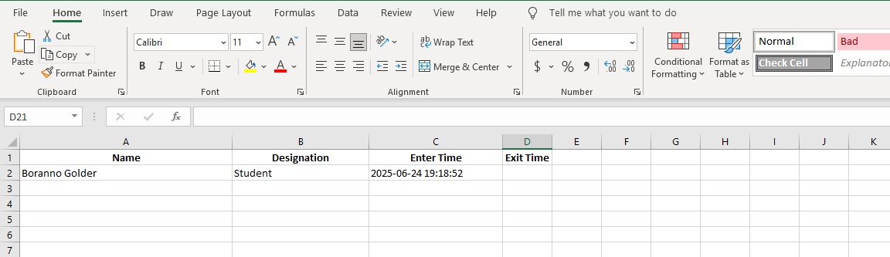

# Campus Guardian - Face Recognition Security System

A comprehensive face recognition security system designed for educational institutions and secure facilities. This system provides real-time monitoring, access control, and intruder detection across multiple camera feeds.


## 📸 Screenshots

<div align="center">

### Main Menu Interface


### Face Recognition in Action


### Person Tracking Feature


### Excel Report Sample


</div>

## 🎯 Features

### Core Functionality
- **Multi-Camera Support**: Monitor multiple cameras simultaneously with role-based assignments
- **Real-Time Face Recognition**: Instant identification of registered individuals
- **Access Control**: Role-based access management for restricted areas
- **Entry/Exit Tracking**: Automatic logging of personnel movement with Excel reports
- **Intruder Detection**: Automatic detection and alert system for unauthorized individuals
- **Person Tracking**: Locate specific individuals across camera network
- **Voice Alerts**: Text-to-speech notifications for security events

### Security Features
- **Password Protection**: Secure admin access with bcrypt encryption
- **Role-Based Access**: Support for Students, Admins, Teachers, and Guests
- **Restricted Area Control**: Configurable access permissions per role
- **Intruder Image Capture**: Automatic saving of unknown faces with timestamps
- **Daily Reports**: Excel-based entry/exit logs with date-wise organization

### User Interface
- **ASCII Art Interface**: Clean, terminal-based user interface
- **Centered Display**: Responsive terminal layout
- **Color-Coded Interface**: Visual feedback with color schemes
- **Menu-Driven Navigation**: Intuitive menu system for all operations

## 🛠️ Installation

### Prerequisites
- Python 3.7 or higher
- USB Camera(s) or IP Camera(s)
- Windows OS (for `pyttsx3` voice alerts)

### Required Libraries
```bash
pip install opencv-python
pip install face-recognition
pip install pandas
pip install openpyxl
pip install pyttsx3
pip install bcrypt
```

### System Requirements
- Minimum 4GB RAM (8GB recommended for multiple cameras)
- USB 2.0 or higher ports for camera connections
- Microphone/Speaker for voice alerts

## 🚀 Quick Start

1. **Clone the Repository**
   ```bash
   git clone https://github.com/yourusername/campus-guardian.git
   cd campus-guardian
   ```

2. **Install Dependencies**
   ```bash
   pip install -r requirements.txt
   ```

3. **Run the Application**
   ```bash
   python main.py
   ```

4. **First-Time Setup**
   - Set up admin password when prompted
   - Add known faces through the menu
   - Assign cameras to specific roles
   - Start face recognition system

## 📁 Project Structure

```
campus-guardian/
├── main.py                 # Main application file
├── requirements.txt        # Python dependencies
├── README.md              # Project documentation
├── known_faces/           # Face database directory
│   ├── students/          # Student face images
│   ├── admins/            # Admin face images
│   ├── teachers/          # Teacher face images
│   └── guests/            # Guest face images
├── intruder/              # Intruder detection images
├── entry_exit_records_*.xlsx  # Daily attendance logs
└── admin_password.hash    # Encrypted admin password
```

## 🎮 Usage Guide

### Initial Setup
1. **Set Admin Password**: Secure your system with a strong password
2. **Add Known Faces**: Register all authorized personnel
3. **Configure Cameras**: Assign roles to each connected camera
4. **Set Access Permissions**: Configure restricted area access by role

### Camera Roles
- **Entry Gate**: Tracks personnel entering the facility
- **Exit Gate**: Tracks personnel leaving the facility
- **Restricted Area**: Monitors high-security zones with access control
- **Classroom**: General monitoring of classroom areas
- **Ordinary Camera**: Standard surveillance cameras

### Menu Options
1. **Add Face**: Register new personnel with camera capture
2. **Delete Face**: Remove personnel from the system
3. **Assign Camera**: Configure camera roles and permissions
4. **Start Face Recognition**: Begin real-time monitoring
5. **Track Person**: Locate specific individuals across cameras
6. **Change Admin Password**: Update system security credentials
7. **Exit**: Close the application

## 📊 Reports and Logging

### Excel Reports
- **Daily Logs**: Automatic generation of daily entry/exit records
- **Timestamp Tracking**: Precise entry and exit time logging
- **Personnel Information**: Name and designation tracking
- **File Naming**: Date-based file organization (`entry_exit_records_DD-MM-YYYY.xlsx`)

### Intruder Detection
- **Automatic Capture**: Unknown faces are automatically photographed
- **Timestamp Naming**: Files saved with precise timestamps
- **Alert System**: Voice notifications for security personnel
- **Image Storage**: Organized storage in `intruder/` directory

## 🔧 Configuration

### Access Control Settings
```python
restricted_area_access = {
    "student": False,    # Students cannot access restricted areas
    "admin": True,       # Admins have full access
    "teacher": True,     # Teachers have restricted area access
    "guest": False       # Guests have limited access
}
```

### Camera Assignment
- Support for multiple USB cameras
- Automatic camera detection
- Role-based camera configuration
- Real-time camera status monitoring

## ⚙️ Technical Specifications

### Face Recognition
- **Library**: face_recognition (dlib-based)
- **Encoding**: 128-dimension face encodings
- **Accuracy**: High-precision face matching
- **Performance**: Real-time processing capability

### Image Processing
- **Library**: OpenCV (cv2)
- **Format**: JPEG image storage
- **Resolution**: Camera-dependent (recommended 720p minimum)
- **Color Space**: RGB processing with BGR display

### Data Storage
- **Face Database**: Organized directory structure
- **Reports**: Excel format (.xlsx)
- **Security**: bcrypt password hashing
- **Timestamps**: ISO format date/time strings

## 🔒 Security Considerations

- **Password Protection**: All admin functions require authentication
- **Encrypted Storage**: Passwords stored using bcrypt hashing
- **Access Logging**: Complete audit trail of all access events
- **Intruder Alerts**: Immediate notification of unauthorized access
- **Data Isolation**: Separate storage for different user categories

## 🤝 Contributing

1. **Fork the Repository**
2. **Create Feature Branch**: `git checkout -b feature/new-feature`
3. **Commit Changes**: `git commit -am 'Add new feature'`
4. **Push to Branch**: `git push origin feature/new-feature`
5. **Create Pull Request**

### Development Guidelines
- Follow PEP 8 style guidelines
- Add comments for complex functions
- Test with multiple camera configurations
- Ensure cross-platform compatibility

## 📝 License

This project is licensed under the MIT License - see the [LICENSE](LICENSE) file for details.

## 🆘 Troubleshooting

### Common Issues

**Camera Not Detected**
- Check USB connections
- Verify camera permissions
- Test camera with other applications

**Face Recognition Accuracy**
- Ensure good lighting conditions
- Use high-quality reference images
- Multiple angles per person recommended

**Performance Issues**
- Reduce number of simultaneous cameras
- Lower camera resolution if needed
- Close unnecessary applications

**Excel File Errors**
- Check file permissions
- Ensure Excel is not open during operation
- Verify disk space availability

## 📞 Support

For support and bug reports:
- **Issues**: [GitHub Issues](https://github.com/boranno/campus-guardian/issues)
- **Discussions**: [GitHub Discussions](https://github.com/boranno/campus-guardian/discussions)
- **Email**: borannogolder@gmail.com

## 🔄 Version History

- **v1.0.0**: Initial release with core functionality
- **v1.1.0**: Added person tracking feature
- **v1.2.0**: Enhanced security with password protection
- **v1.3.0**: Improved UI with centered display

## 🙏 Acknowledgments

- **face_recognition library**: Adam Geitgey's face recognition toolkit
- **OpenCV**: Computer vision processing
- **pandas**: Data manipulation and analysis
- **pyttsx3**: Text-to-speech functionality

---

**⭐ Star this repository if you find it useful!**

Made with ❤️ for campus security and educational institutions.
